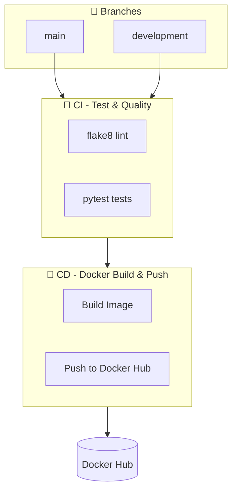

Yapay Zeka Destekli Otel Kiralama Sistemi
# 🏨 StayFinder — Otel Rezervasyon Platformu

> Türkiye genelinde otelleri arayın, karşılaştırın ve kolayca rezervasyon yapın.


---

## 🚀 Özellikler

- 🔐 **Kullanıcı Kimlik Doğrulama** — Kayıt, Giriş, Çıkış ve Rol Tabanlı Erişim (Kullanıcı / Otel Sahibi / Admin)
- 🏩 **Otel Yönetimi** — Otel Ekleme, Düzenleme, Silme, Fotoğraf Yükleme ve Admin Onay Sistemi
- 🛏️ **Oda Tipi Yönetimi** — Oda ekleme, kapasite ve fiyat belirleme
- 📅 **Rezervasyon Sistemi** — Tarih çakışması kontrolü, anlık fiyat hesaplama ve rezervasyon iptal etme
- ⭐ **Değerlendirme Sistemi** — Otel yorumları ve puan ortalaması (mükerrer yorum koruması)
- 🔍 **Gelişmiş Arama** — Şehir ve yıldız sayısına göre filtreleme
- 📱 **Responsive Tasarım** — Mobil, tablet ve masaüstü uyumlu Glassmorphism arayüzü
- 👨‍💼 **Admin Paneli** — İstatistikler, otel onaylama ve kullanıcı aktivasyon yönetimi

---

## 🛠️ Teknoloji Yığını

| Katman | Teknoloji |
|--------|-----------|
| **Backend** | Python 3.11+, Flask 3.x |
| **Veritabanı ORM** | Flask-SQLAlchemy, Flask-Migrate |
| **Kimlik Doğrulama** | Flask-Login, Werkzeug (parola hashleme) |
| **Form Doğrulama** | Flask-WTF, WTForms |
| **Şablon Motoru** | Jinja2 |
| **Veritabanı** | SQLite (Geliştirme) |
| **Frontend** | Vanilla CSS (Glassmorphism), Vanilla JS |
| **Yazı Tipi** | Google Fonts — Inter |

---

## 🏗️ Mimari

Proje, sorumlulukları net biçimde ayıran **4 Katmanlı Mimari** üzerine inşa edilmiştir:

```
Presentation Layer (routes/ + templates/)
        ↓
Service Layer (services/)       ← İş mantığı buradadır
        ↓
Repository Layer (repositories/)  ← Veritabanı sorguları buradadır
        ↓
Data Layer (models/)            ← SQLAlchemy modelleri
```

---

## 📁 Proje Yapısı

```
proje_otel/
├── app/
│   ├── __init__.py          # Application Factory
│   ├── config.py            # Yapılandırma sınıfları
│   ├── extensions.py        # Flask eklentileri (db, login_manager...)
│   ├── models/              # SQLAlchemy veri modelleri
│   ├── repositories/        # Veritabanı sorgu katmanı
│   ├── services/            # İş mantığı katmanı
│   ├── routes/              # Presentation / Blueprint katmanı
│   ├── forms/               # WTForms form sınıfları
│   ├── utils/               # Dekoratörler ve yardımcı fonksiyonlar
│   ├── templates/           # Jinja2 HTML şablonları
│   └── static/              # CSS, JS ve yüklenen görseller
├── migrations/              # Flask-Migrate migrasyon dosyaları
├── seed.py                  # Örnek veri yükleme scripti
├── run.py                   # Uygulama giriş noktası
├── requirements.txt
└── .env
```

---

## ⚙️ Kurulum ve Çalıştırma

### 1. Depoyu Klonlayın
```bash
git clone <repo-url>
cd proje_otel
```

### 2. Sanal Ortam Oluşturun
```bash
python -m venv venv

# Windows
venv\Scripts\activate

# macOS / Linux
source venv/bin/activate
```

### 3. Bağımlılıkları Yükleyin
```bash
pip install -r requirements.txt
```

### 4. Ortam Değişkenlerini Ayarlayın
`.env.example` dosyasını kopyalayarak `.env` oluşturun:
```bash
cp .env.example .env
```
`.env` dosyasını düzenleyin:
```
SECRET_KEY=cok-gizli-bir-anahtar
DATABASE_URL=sqlite:///stayfinder.db
FLASK_ENV=development
```

### 5. Veritabanını Oluşturun
```bash
flask db upgrade
python seed.py   # Admin kullanıcı ve örnek otel verilerini yükler
```

### 6. Uygulamayı Başlatın
```bash
flask run
```
Tarayıcınızda `http://127.0.0.1:5000` adresine gidin.

---

## 👤 Varsayılan Kullanıcılar (seed.py sonrası)

| Rol | E-posta | Şifre |
|-----|---------|-------|
| Admin | admin@stayfinder.com | admin123 |
| Otel Sahibi | owner@stayfinder.com | owner123 |
| Kullanıcı | user@stayfinder.com | user123 |

---

## 📌 Git Branch Stratejisi

```
main ← develop ← feature/OTEL-XX-aciklama
```

| Branch | Açıklama |
|--------|----------|
| `main` | Üretim ortamı — yalnızca etiketli sürümler |
| `develop` | Entegrasyon dalı |
| `feature/OTEL-epic-*` | EPIC bazlı geliştirme dalları |

---

## 📋 Sürüm Geçmişi

| Sürüm | Branch | Açıklama |
|-------|--------|----------|
| `v0.1.0` | EPIC-1 | Proje altyapısı |
| `v0.2.0` | EPIC-2 | Veri katmanı ve modeller |
| `v0.3.0` | EPIC-3 | Kimlik doğrulama sistemi |
| `v0.4.0` | EPIC-4 | Otel CRUD ve rezervasyon |
| `v1.0.0` | EPIC-5 | Frontend ve son polish |

---

## � Docker ile Çalıştırma

### Docker Hub'dan Çekme
```bash
docker pull <docker-hub-kullaniciadiniz>/otel-rezervasyon:latest
```

### Docker ile Çalıştırma
```bash
docker run -d \
  --name otel-app \
  -p 5000:5000 \
  -e FLASK_ENV=production \
  -e SECRET_KEY="uretim-gizli-anahtari" \
  -e DATABASE_URL="sqlite:///otel.db" \
  <docker-hub-kullaniciadiniz>/otel-rezervasyon:latest
```

### Docker Compose ile Çalıştırma
```bash
docker compose up -d
```

---

## 🔄 CI/CD Pipeline

Bu proje, **`main`** ve **`development`** branchlerine push yapıldığında devreye giren **GitHub Actions** tabanlı bir CI/CD pipeline'ına sahiptir.

### Pipeline Akışı



| Aşama | Açıklama |
|-------|----------|
| **Tetikleyiciler** | `main` ve `development` branchlerine push, ayrıca bu branchlere açılan PR'lar |
| **CI (Sürekli Entegrasyon)** | Python kurulumu → bağımlılıklar → flake8 lint → pytest çalıştırma |
| **CD (Sürekli Dağıtım)** | Docker Buildx ile multi-platform build → Docker Hub'a push |

### Branch Bazlı Etiket Stratejisi

| Branch | Docker Etiketleri | Kullanım |
|--------|-------------------|----------|
| **`main`** | `latest`, `main`, `sha-<hash>`, `<run>` | Üretim (production) |
| **`development`** | `dev`, `development`, `sha-<hash>`, `<run>` | Test / Staging |

```bash
# Production (main branch)
docker pull <kullanici>/otel-rezervasyon:latest

# Development (development branch)
docker pull <kullanici>/otel-rezervasyon:dev
```

### GitHub Secrets Konfigürasyonu

Pipeline'ın çalışması için GitHub repository ayarlarına şu **secrets** (sırlar) eklenmelidir:

| Secret Adı | Açıklama | Nereden Alınır? |
|-----------|----------|-----------------|
| `DOCKER_HUB_USERNAME` | Docker Hub kullanıcı adınız | [hub.docker.com](https://hub.docker.com) |
| `DOCKER_HUB_TOKEN` | Docker Hub Access Token | Account Settings → Security → New Access Token |

> **⚠️ Önemli:** Docker Hub şifrenizi değil, **Access Token** kullanın! Token oluştururken **Read, Write, Delete** izinlerini verin.

---

## �📄 Lisans

Bu proje MIT Lisansı altında lisanslanmıştır.
