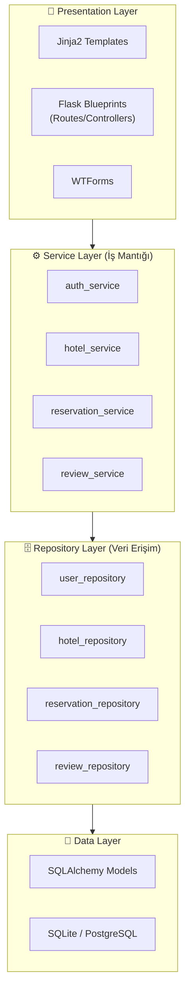
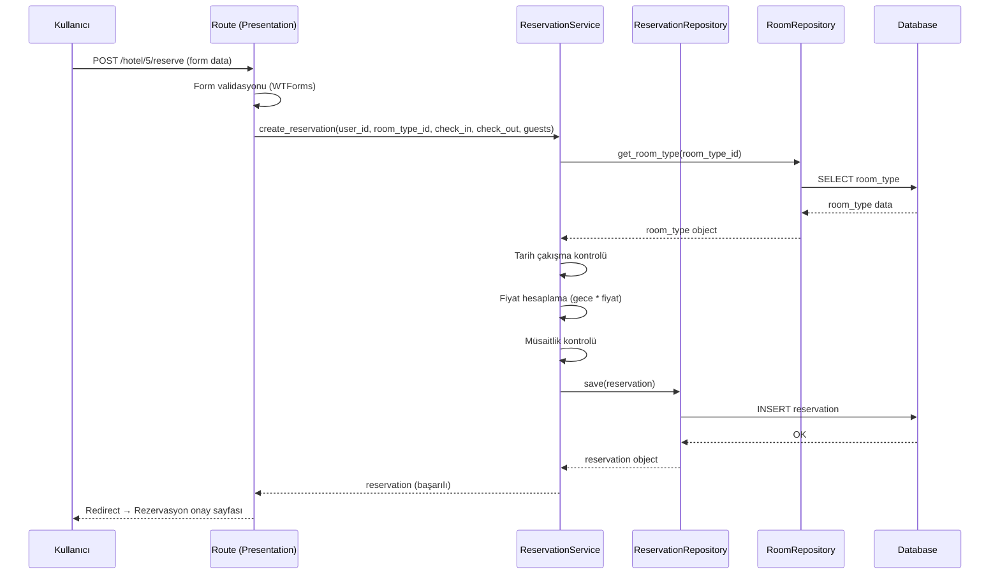
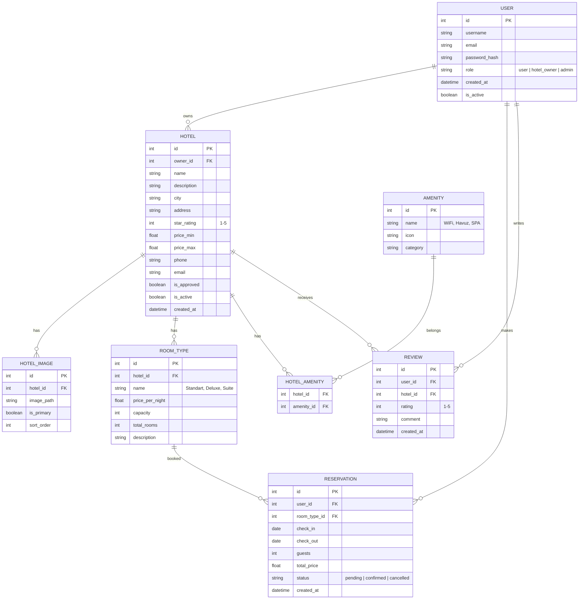

# 🏨 Otel Rezervasyon Web Sitesi — İmplementasyon Planı

Kullanıcıların uygun otelleri arayıp listeleyebildiği, otel sahiplerinin kendi otellerini yönetebildiği ve admin paneli üzerinden tüm sistemin kontrol edilebildiği tam kapsamlı bir otel web sitesi.

**Mimari:** Katmanlı Mimari (Layered Architecture)

---

## Mimari Yaklaşım — Katmanlı Mimari



### Katmanlar Arası Sorumluluk

| Katman | Sorumluluk | Ne yapmaz? |
|--------|------------|------------|
| **Presentation** | HTTP request/response, form validasyonu, template render | İş mantığı, DB sorgusu |
| **Service** | İş kuralları, validasyon, akış kontrolü | DB sorgusu, HTTP işlemi |
| **Repository** | CRUD operasyonları, DB sorguları, filtreleme | İş mantığı, HTTP işlemi |
| **Data (Model)** | Tablo yapısı, ilişkiler, basit hesaplamalar | Hiçbir mantık |

### Örnek Akış — Rezervasyon Oluşturma



---

## Teknoloji Yığını

| Katman | Teknoloji | Neden? |
|--------|-----------|--------|
| **Backend** | Python 3.11+ / Flask | Hafif, esnek, hızlı prototipleme |
| **Veritabanı** | SQLite (dev) → PostgreSQL (prod) | Başlangıç kolay, sonra ölçeklenebilir |
| **ORM** | SQLAlchemy + Flask-Migrate | Veritabanı yönetimi ve migration |
| **Auth** | Flask-Login + Werkzeug | Oturum yönetimi ve şifre hash |
| **Frontend** | Jinja2 + HTML/CSS/JS | Server-side rendering, modern UI |
| **Form** | Flask-WTF / WTForms | CSRF koruması ve form validasyonu |
| **Dosya Upload** | Werkzeug + Pillow | Otel fotoğrafları |

---

## Veritabanı Şeması



---

## Kullanıcı Rolleri ve Yetkileri

| Özellik | Misafir | Kullanıcı | Otel Sahibi | Admin |
|---------|---------|-----------|-------------|-------|
| Otelleri görüntüle | ✅ | ✅ | ✅ | ✅ |
| Otel arama/filtreleme | ✅ | ✅ | ✅ | ✅ |
| Rezervasyon yap | ❌ | ✅ | ✅ | ✅ |
| Yorum yaz | ❌ | ✅ | ❌ | ✅ |
| Otel ekle/düzenle | ❌ | ❌ | ✅ (kendi) | ✅ (tümü) |
| Otel onayla | ❌ | ❌ | ❌ | ✅ |
| Kullanıcı yönetimi | ❌ | ❌ | ❌ | ✅ |

---

## Proje Dizin Yapısı (Katmanlı Mimari)

```
proje_otel/
├── app/
│   ├── __init__.py                  # Application Factory
│   ├── config.py                    # Konfigürasyon sınıfları
│   ├── extensions.py                # Flask eklenti başlatma
│   │
│   ├── models/                      # 💾 DATA LAYER
│   │   ├── __init__.py
│   │   ├── user.py
│   │   ├── hotel.py
│   │   ├── room.py
│   │   ├── amenity.py
│   │   ├── reservation.py
│   │   └── review.py
│   │
│   ├── repositories/                # 🗄️ REPOSITORY LAYER
│   │   ├── __init__.py
│   │   ├── base_repository.py       # Generic CRUD base class
│   │   ├── user_repository.py
│   │   ├── hotel_repository.py
│   │   ├── room_repository.py
│   │   ├── amenity_repository.py
│   │   ├── reservation_repository.py
│   │   └── review_repository.py
│   │
│   ├── services/                    # ⚙️ SERVICE LAYER
│   │   ├── __init__.py
│   │   ├── auth_service.py
│   │   ├── hotel_service.py
│   │   ├── reservation_service.py
│   │   └── review_service.py
│   │
│   ├── routes/                      # 🎨 PRESENTATION LAYER
│   │   ├── __init__.py
│   │   ├── main.py
│   │   ├── auth.py
│   │   ├── hotel.py
│   │   ├── dashboard.py
│   │   ├── hotel_owner.py
│   │   └── admin.py
│   │
│   ├── forms/
│   │   ├── __init__.py
│   │   ├── auth_forms.py
│   │   ├── hotel_forms.py
│   │   └── reservation_forms.py
│   │
│   ├── templates/
│   │   ├── base.html
│   │   ├── components/
│   │   │   ├── navbar.html
│   │   │   ├── footer.html
│   │   │   ├── hotel_card.html
│   │   │   └── flash_messages.html
│   │   ├── auth/
│   │   │   ├── login.html
│   │   │   └── register.html
│   │   ├── main/
│   │   │   ├── index.html
│   │   │   └── about.html
│   │   ├── hotel/
│   │   │   ├── list.html
│   │   │   ├── detail.html
│   │   │   └── search.html
│   │   ├── dashboard/
│   │   │   ├── user.html
│   │   │   ├── owner.html
│   │   │   └── reservations.html
│   │   └── admin/
│   │       ├── dashboard.html
│   │       ├── hotels.html
│   │       └── users.html
│   │
│   ├── static/
│   │   ├── css/
│   │   │   └── style.css
│   │   ├── js/
│   │   │   └── main.js
│   │   ├── images/
│   │   └── uploads/
│   │
│   └── utils/
│       ├── __init__.py
│       ├── decorators.py
│       └── helpers.py
│
├── migrations/
├── seed.py                          # Başlangıç verileri
├── .env
├── .gitignore
├── requirements.txt
├── run.py
└── README.md
```

---

## User Review Required

> [!IMPORTANT]
> **Ödeme sistemi:** Bu planda gerçek ödeme entegrasyonu yok. Rezervasyonlar "onay bekliyor" statüsünde oluşturulacak. Ödeme sistemi istenirse planı güncelleyebilirim.

> [!IMPORTANT]
> **Çoklu dil desteği:** Şu an yalnızca Türkçe planlandı. İngilizce desteği istiyor musunuz?

> [!WARNING]
> **Harita entegrasyonu:** Google Maps veya Leaflet.js ile otel konumu gösterimi dahil edilsin mi?

---

## Open Questions

> [!IMPORTANT]
> 1. **Otel sahibi** ayrı kayıt formundan mı olacak, yoksa mevcut kullanıcı sonradan yükseltilecek mi?
> 2. **E-posta doğrulama** gerekli mi?
> 3. **Tema tercihi:** Koyu mu, açık mı, her ikisi mi?

---

## Verification Plan

### Automated Tests
- Her Epic sonunda `flask run` ile uygulama ayağa kaldırılacak
- Tarayıcıda tüm sayfa akışları kontrol edilecek
- Katmanlar arası veri akışı doğrulanacak

### Manuel Doğrulama
- **EPIC-1:** Uygulama başlatılıyor mu? Boş sayfa geliyor mu?
- **EPIC-2:** Tablolar oluşuyor mu? Repository CRUD çalışıyor mu?
- **EPIC-3:** Kayıt/giriş/çıkış + rol bazlı erişim kontrolü
- **EPIC-4:** Otel CRUD, arama, filtreleme, service layer iş kuralları
- **EPIC-5:** Responsive tasarım, animasyonlar, tema geçişi

### GitHub Push Stratejisi
- Her **Story** tamamlandığında bir commit
- Her **Epic** tamamlandığında bir Git tag (v0.1, v0.2...)
- Commit mesajları: `[OTEL-XX] Story açıklaması`
